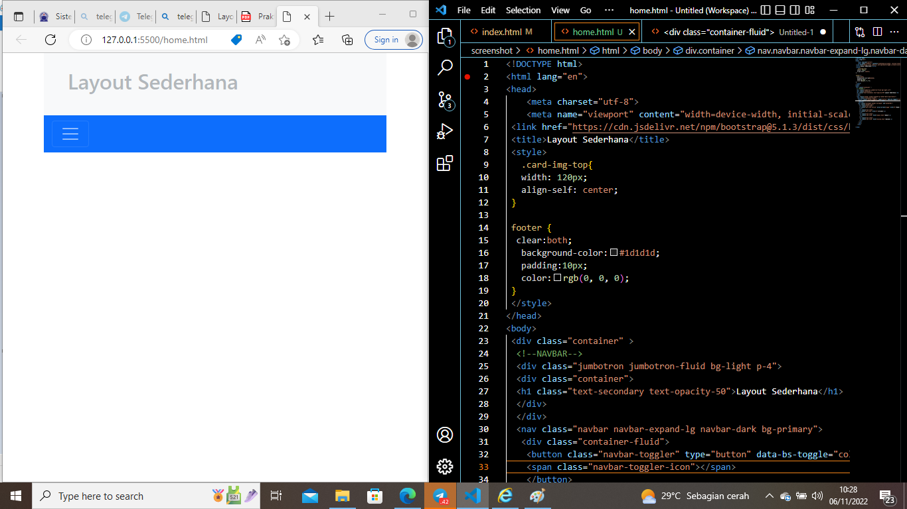
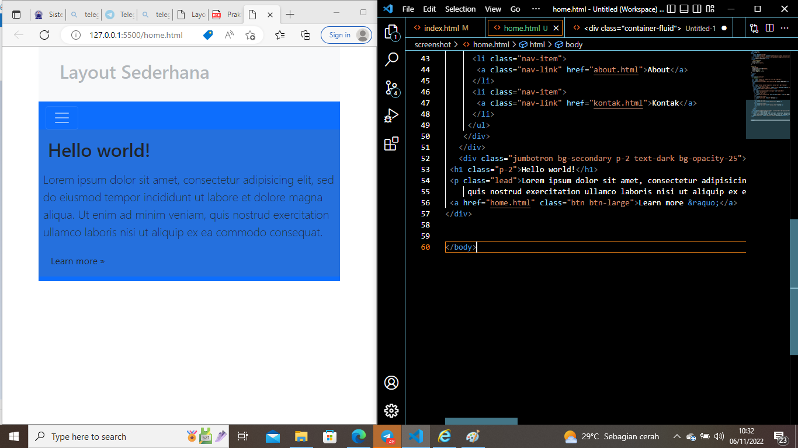
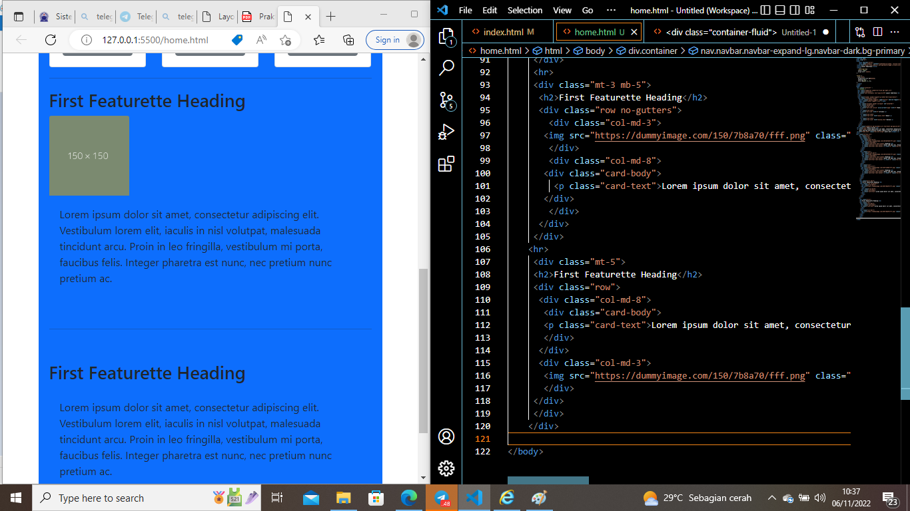
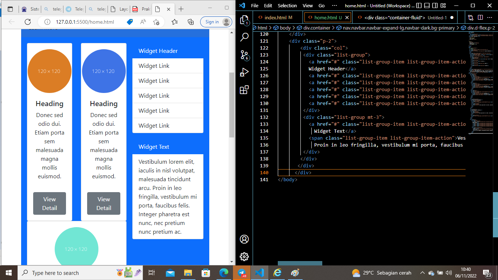
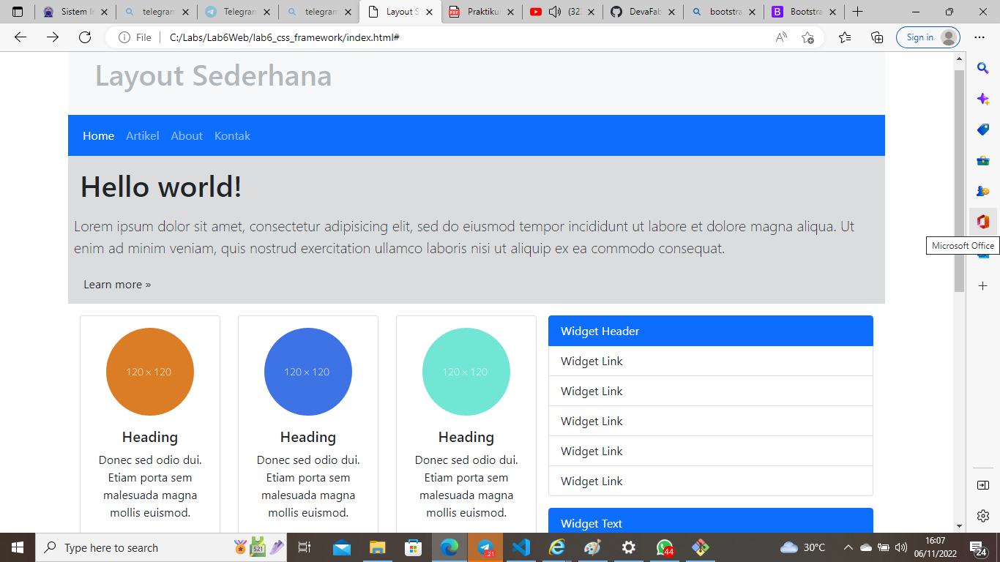

# Lab6Web
## Membuat Framework Bootsrtap
### Langkah - Langkah Pratikum 6
#### Buka web https://getbootstrap.com/
Karna Saya Disini Menggunakan Secara Online, Jadi Langsung Copy Framework pada web boostrap tersebut.

#### Membuat Navbar dengan framework yang ada pada pada bootstrap, 
Navbar ini berfungsi untuk memberi layanan menuju halaman lain (Navigasi) untuk lebih jelasnya simak pada gambar dibawah ini

#### membuat hero panel disini saya menggunakan class jumbroton warna background secondary dan opacity sebesar 25 

#### Menambah element lain pada content seperti gambar dan lain sebagainya,
pada bootstrap kita bisa menggunakan cards, disini saya akan menggunakan col untuk membagi gambar per bagian masing-masing agar hasilnya lebih rapih. Dan membuat gambar menjadi bulat dengan menggunakan class rounded-circle

#### Menambahkan widget link pada sebelah kanan card 1

#### Hasil dari pratikum yang saya buat

